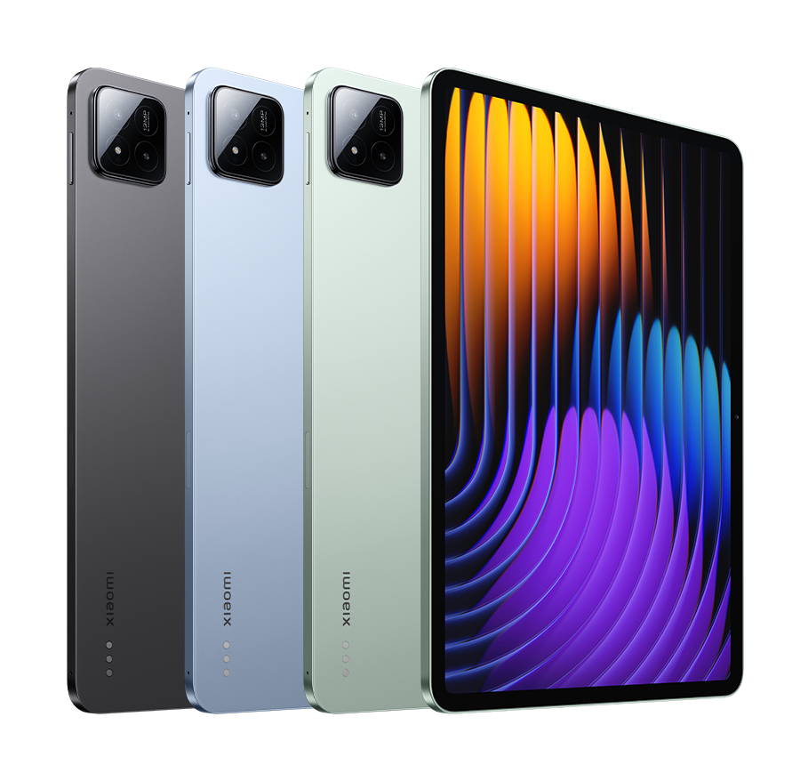

#  Device Tree for Xiaomi Pad 7 (uke)

## Spec Sheet

| Feature                 | Specification                                                              |
| :---------------------- | :--------------------------------                                          |
| CPU                     | 1x2.8 GHz Cortex-X4 & 4x2.6 GHz Cortex-A720 & 3x1.9 GHz Cortex-A520        |
| Chipset                 | Qualcomm SM7675-AB Snapdragon 7+ Gen 3 (4 nm)                              |
| GPU                     | Adreno 735                                                                 |
| Memory                  | 8 GB / 12 GB                                                               |
| Shipped Software        | Android 14, HyperOS                                                        |
| Storage                 | 128 GB / 256 GB                                                            |
| Battery                 | 8850 mAh                                                                   |
| Dimensions              | 251.2 x 173.4 x 6.2 mm                                                     |
| Display                 | 11.2 inches, 373.7 cm2 (~85.8% screen-to-body ratio)                       |
| Rear Camera             | 13 MP, f/2.2, (wide), 1/3.06", 1.12µm, PDAF                                |
| Front Camera            | 8 MP, f/2.3, (wide), 1/4.0", 1.12µm                                        |
| Release Date            | October 2024                                                               |
## Device Picture

